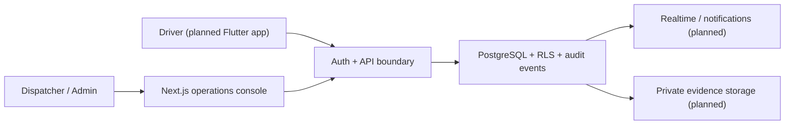

# CarrierFlow

> A multi-tenant carrier operations platform for dispatch teams and drivers.

**CarrierFlow** is a US-first SaaS project designed to replace fragmented carrier workflows—calls, texts, spreadsheets, navigation apps, and scattered delivery proof—with one operational system. It is being built for cargo vans, box trucks, hotshot, and mixed fleets, with Canada supported as a trip endpoint rather than a separate commercial market.

**Current status:** Private-pilot foundation complete. This repository is intentionally transparent about what is working today and what remains on the roadmap.

## Why this project

Small carriers need visibility and control without enterprise-only tooling. CarrierFlow is designed around a few operational truths:

- Dispatchers assign work; drivers execute it without an accept/reject flow.
- A trip's economics must distinguish **empty miles** from **loaded miles**.
- Location, delivery evidence, and audit history are sensitive operational data.
- Multi-carrier SaaS requires enforcement in the database, not just hidden UI controls.

The product pairs a Next.js operations console with a planned Flutter driver app. The first completed phase focuses on the engineering foundations that make later dispatch features safe to build.

## What is built

### Phase 1 — Foundation

- **Multi-tenant PostgreSQL model** for companies, memberships, roles, drivers, vehicles, assignments, shifts, and audit events.
- **Row Level Security (RLS)** enforced and tested across company boundaries, including anonymous and cross-tenant denial cases.
- **Transactional authorization flows** for owner-only invitations, fleet changes, assignments, and shift lifecycle events.
- **Forward-only database migrations** with an explicit upgrade test from fleet schema `0003` to hardening migration `0004`.
- **Immediate access lifecycle controls:** deactivating a driver or vehicle closes open assignments/shifts where appropriate, preserves history, and writes audit events.
- **Bilingual admin shell** (English/Spanish) selected from the request's `Accept-Language` preference.
- **Accessible admin navigation:** keyboard skip link, semantic landmarks, visible focus states, textual operational status, and a 44px control-size contract.
- **Honest route availability:** The Fleet domain and its foundational view are implemented; Operations, Loads, Drivers, and Vehicles have localized placeholder screens until their workflows ship.

## Engineering signals

| Concern | How CarrierFlow addresses it |
| --- | --- |
| Tenant isolation | PostgreSQL RLS, forced policies, composite tenant keys, and pgTAP denial tests |
| Authorization | Database-authoritative RPCs with constrained grants, locked search paths, and typed application errors |
| Auditability | Actor, before/after values, timestamps, and transactional audit writes |
| Migration safety | Immutable published migrations and a verified `0003 → 0004` upgrade path |
| Accessibility | Semantic navigation and landmarks, keyboard skip link, minimum target sizing, non-color-only states |
| Quality gates | TypeScript, Vitest, Playwright, Supabase/pgTAP, dependency audit, and build verification |

## Architecture



### Technology

- **Web:** Next.js 16, React 19, TypeScript 6
- **Data & auth:** Supabase-compatible PostgreSQL, RLS, SQL migrations, pgTAP
- **Testing:** Vitest, Playwright, Supabase database tests
- **Planned mobile:** Flutter for Android and iOS
- **Deployment direction:** Docker Compose + Dokploy on a self-managed Ubuntu server

## Verified locally

The current Phase 1 gate passes:

- **142** PostgreSQL/pgTAP assertions
- **22** admin unit and component tests
- **3** Playwright end-to-end checks
- Production Next.js build, lint, typecheck, and dependency audit

The database test suite covers both a clean database reset and a real forward upgrade from migration `0003` to `0004`.

## Run it locally

### Prerequisites

- Node.js `24.20.0`
- Corepack with pnpm `11.24.0`
- Docker Desktop or a Docker daemon

```bash
corepack pnpm@11.24.0 install --frozen-lockfile
corepack pnpm@11.24.0 exec supabase start
corepack pnpm@11.24.0 exec supabase db reset
corepack pnpm@11.24.0 --filter @carrierflow/admin dev
```

Open `http://127.0.0.1:3000`.

### Verify the project

```bash
corepack pnpm@11.24.0 typecheck
corepack pnpm@11.24.0 lint
corepack pnpm@11.24.0 test
corepack pnpm@11.24.0 exec supabase test db
corepack pnpm@11.24.0 test:e2e
```

> The local Supabase CLI stack is for development and testing only. Production is planned as a separately hardened, self-hosted Docker deployment with backups, monitoring, and secrets outside Git.

## Product roadmap

| Now | Next | Later |
| --- | --- | --- |
| Tenant security, fleet lifecycle, bilingual operations shell | Loads, stops, pricing by empty/loaded miles, evidence, incidents, driver workflows | ELD/load-board integrations, billing, route optimization, advanced analytics |

The project deliberately does **not** yet claim production GPS tracking, payments, ELD compliance, truck-safe navigation, or load-board integrations.

## Project documentation

- [Product requirements document](docs/product/carrierflow-prd.md)
- [Self-hosted deployment decision](docs/architecture/adr-001-self-hosted-dokploy.md)
- [Implementation blueprint](blueprints/carrierflow/blueprint.md)
- [Phase 1 build plan](docs/superpowers/plans/2026-08-27-carrierflow-pilot-build.md)

## For recruiters and collaborators

This repository is a portfolio-quality build in progress, with the security and data-model work intentionally landing before feature volume. The most relevant areas to review are:

- `supabase/migrations/` for tenant boundaries, audit design, and forward migration discipline
- `supabase/tests/database/` for executable RLS and lifecycle guarantees
- `apps/admin/` for the Next.js shell, accessibility, localization, and test coverage
- `docs/` for product reasoning and deployment trade-offs

CarrierFlow values precise operational rules, transparent constraints, and verification over impressive-but-unproven claims.
